# 第 6 章 树和二叉树

## 一、基础知识题

### 6.1 已知一棵树的集合为{<I, M>, <I, N>, <E, I>, <B, E>, <B, D>, <A, B>, <G, J>, <G, K>, <C, G>, <C, F>, <H, L>, <C, H>, <A, C>}，请画出这棵树，并回答下列问题：

##### (1)哪个是根结点？

##### (2)哪些是叶子节点？

##### (3)哪个是结点 G 的双亲？

##### (4)哪些是结点 G 的祖先？

##### (5)哪些是结点 G 的孩子？

##### (6)哪些是结点 E 的子孙？

##### (7)哪些是结点 E 的兄弟？哪些是结点 F 的兄弟？

##### (8)结点 B 和 N 的层次号分别是什么？

##### (9)树的深度是多少？

##### (10)以结点 C 为根的子树的深度是多少？

> 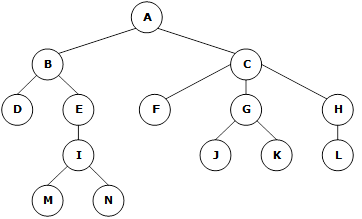
>
> (1) A  
> (2) D, M, N, F, J, K, L  
> (3) C  
> (4) A, C  
> (5) J, K  
> (6) I, M, N  
> (7) E 的兄弟是 D，F 的兄弟是 G 和 H  
> (8) 2 和 5  
> (9) 5  
> (10) 3

### 6.2 一棵度为 2 的树与一棵二叉树有何区别？

> 二叉树有序，而度为 2 的树未必有序。

### 6.3 试分别画出具有 3 个结点的树和 3 个结点的二叉树的所有不同形态。

> 具有 3 个结点的树有以下两种形态：
>
> 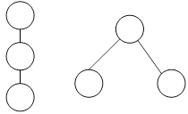
>
> 具有 3 个结点的二叉树有以下 5 种形态：
>
> 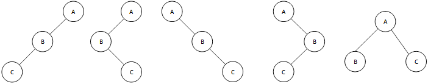

### 6.4 一棵深度为 H 的满 k 叉树有如下性质：第 H 层上的结点都是叶子结点，其余各层上每个结点都有 k 棵非空子树。如果按层次顺序从 1 开始对全部结点编号，问：

##### (1)各层的结点数目是多少？

##### (2)编号为 p 的结点的父结点（若存在）的编号是多少？

##### (3)编号为 p 的结点的第 i 个儿子结点（若存在）的编号是多少？

##### (4)编号为 p 的结点有右兄弟的条件是什么？其右兄弟的编号是多少？

> (1) 第 i 层有 k<sub>i-1</sub>个结点。  
> (2) p=1 时，该结点为根，无父结点；否则，其父结点编号为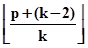(k≥2)。  
> (3) p 结点第 k-1 个儿子的编号为 p\*k。所以，若其第 i 个孩子存在，则其编号为：p\*k+(i-(k-1))。  
> (4) (p-1)%k≠0 时，该结点有右兄弟，其右兄弟编号为 p+1。

### 6.5 已知一棵深度为 k 的树中有 n1 个度为 1 的结点，n2 个度为 2 的结点，…，nk 个度为 k 的结点，问该树中有多少个叶子结点？

> 设该树共有 n 个结点，其中叶子结点有 n0 个。  
> 结点关系：n = n0 + n1 + n2 + … + nk  
> 分支关系：n-1 = n1 + 2▪n2 + … + k▪nk  
> 因而可得：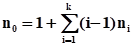

### 6.6 已知在一棵含有 n 个结点的树中，只有度为 k 的分支结点和度为 0 的叶子结点。试求该树含有的叶子结点的书目。

> 设该树度为 k 的结点有 nk 个，度为 0 的结点有 n0 个。  
> 结点关系：n = nk + n0  
> 分支关系：n-1 = k▪nk  
> 因而可得：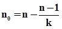

### 6.7 一棵含有 n 个结点的 k 叉树，可能达到的最大深度和最小深度各为多少？

> k 叉树为有序树，其达到最大深度时为单支树，其深度为：n；  
> 达到最小深度时为完全 k 叉树，其深度为：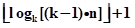。

### 6.8 证明：一棵满 k 叉树上的叶子结点数 n0 和非叶子结点数 n1 之间满足以下关系：n0=(k-1)n1+1。

> 证明：由于是满 k 叉树，因而只有度为 0 和度为 k 的结点。设度为 0 的结点有 n0 个，度为 k 的结点有 n1 个，结点总数为 n，则：  
> 结点关系：n = n1 + n0  
> 分支关系：n-1 = k▪n1  
> 因而可得：n0 = (k-1)n1 + 1

### 6.9 试分别推导含有 n 个结点和含 n0 个叶子结点的完全三叉树的深度 H。

> (1) n 个结点的情况：  
> 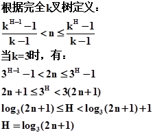  
> (2) 结合 6.8 可得，当叶子结点有 n0 个时，总结点数为：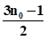  
> 再结合(1)的结论可得： 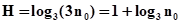

### 6.10 对于那些所有非叶子结点均有非空左右子树的二叉树：

##### (1)试问：有 n 个叶子结点的树中共有多少个结点？

##### (2)试证明：，其中 n 为叶子结点的个数，li 表示第 i 个叶子结点所在的层次（设根结点所在的层次为 1）。

> (1)根据题意，此树只有度为 0 和度为 2 的结点。设其度为 2 的结点有 n<sub>2</sub>个，总结点数为 n<sub>总</sub>，则：  
> 结点关系：n<sub>总</sub> = n + n<sub>2</sub>  
> 分支关系：n<sub>总</sub>-1 = 2 ▪n<sub>2</sub>  
> 因而可得：n<sub>总</sub> = 2n - 1
>
> (2)用数学归纳法证明：
>
> > 当 n=1 时，只有一个叶子结点，也就是树中只有根结点，l1=1，因而：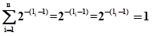  
> > 满足题意。
>
> > 假设当树中有 n(n>1)个结点时，等式成立，且 p 为其任一叶子结点。此时有：  
> > 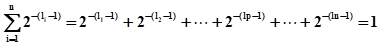  
> > 那么当叶子结点个数为 n+1 时，树的总结点数增 2，叶子结点增 1。假设增加的叶子结点来源于 p 的孩子结点。此时，p 不再作为叶子结点，其孩子结点充当叶子结点，设其两个孩子结点为 x 个 y，则有等式：lp +1 = lx = ly。因而有：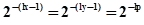  
> > 故：  
> > 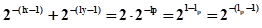  
> > 因此有：  
> > 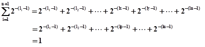
>
> > 至此，原等式得证，即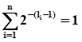成立。

### 6.11 在二叉树的顺序存储结构中，实际上隐含着双亲的信息，因此可和三叉链表对应。假设每个指针域占 4 个字节的存储，每个信息域占 k 个字节的存储。试问：对于一棵有 n 个结点的二叉树，且在顺序存储结构中最后一个结点的下标为 m，在什么条件下顺序存储结构比三叉链表更节省空间？

> 采用三叉链表结构，需要 n(k+12)个字节的存储空间。采用顺序存储结构，需要 mk 个字节的存储空间，则当 mk<n(k+12)时，即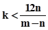时，采用顺序存储比采用三叉链表更节省空间。

### 6.12 对题 6.3 所得各种形态的二叉树，分别写出前序、中序和后序遍历的序列。

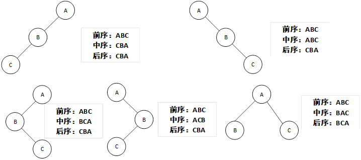

### 6.13 假设 n 和 m 为二叉树中两结点，用“1”、“0”或“Φ”（分别表示肯定、恰恰相反或者不一定）填写下标：

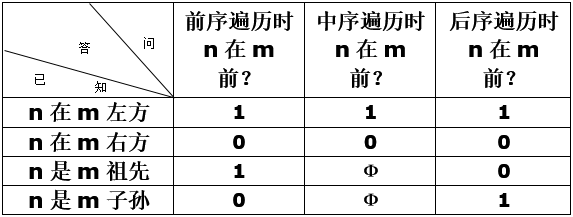

##### 注：如果（1）离 a 和 b 最近的共同祖先 p 存在，且（2）a 在 p 的左子树中，b 在 p 的右子树中，则称 a 在 b 的左方（即 b 在 a 的右方）。

### 6.14 找出所有满足下列条件的二叉树：

##### (a)它们在先序遍历和中序遍历时，得到的结点访问序列相同；

##### (b)它们在后序遍历和中序遍历时，得到的结点访问序列相同；

##### (c)它们在先序遍历和后序遍历时，得到的结点访问序列相同。

> (a) 不含左子树的二叉树  
> (b) 不含右子树的二叉树  
> (b) 既无左子树，又无右子树的二叉树

### 6.15 请对下图所示二叉树进行后序线索化，为每个空指针建立相应的前驱或后继线索。

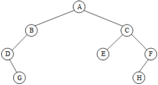

> 此树的后序遍历序列为：G D B E H F C A  
> 后序线索化之后的树为：  
> 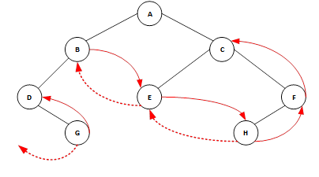

### 6.16 将下列二叉链表改为先序线索链表（不画出树的形态）。

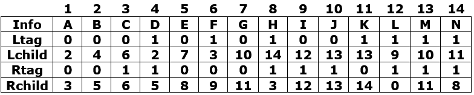

> 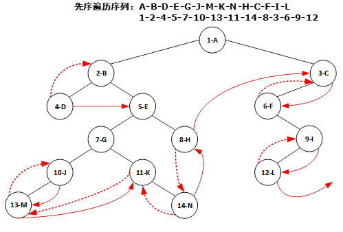

### 6.17 阅读下列算法，若有错，则改正之。

```c
BiTree InSucc (BiTree q)
{
  //已知q是指向中序线索二叉树上某个结点的指针。
  //本函数返回指向*q的后继的指针。

  r = q->rchild;
  if(!r->rtag)
    while(!r->rtag)
      r = r->rchild;
  return r;
}//InSucc
```

> 有 3 处错误，应该先往左遍历。
>
> ```c
> BiTree InSucc (BiTree q)
> {
>   r = q->rchild;
>   if(!r->ltag)
>     while(!r->ltag)
>       r = r->lchild;
>   return r;
> }//InSucc
> ```

### 6.18 试讨论，能否在一棵中序全线索二叉树上查找给定结点\*p 在后序序列中的后继。

> (1)若 p 为根结点，则其在后序序列中无后继。  
> (2)若 p 不为根结点，则中序线索遍历查找 p 的双亲结点。
>
> > 若 p 为其双亲结点的左孩子，则其在后序序列中的后继为其兄弟结点最左下的子孙；  
> > 若 p 为其双亲结点的右孩子，则其在后序序列中的后继为双亲结点。

### 6.19 分别画出和下列树对应的各个二叉树：

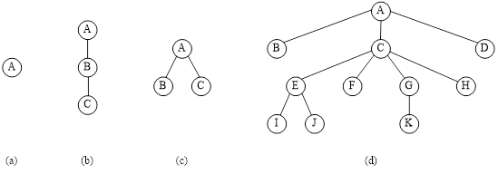

> 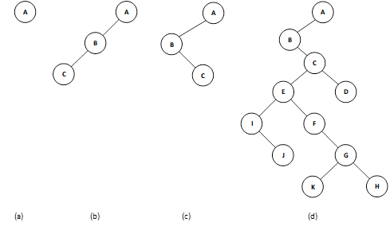

### 6.20 将下列森林转换为相应的二叉树，并分别按以下说明进行线索化：

##### (1)先序前驱线索化；

##### (2)中序全线索化前驱线索和后继线索；

##### (3)后序后继线索化。

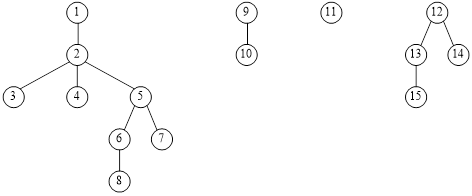

> 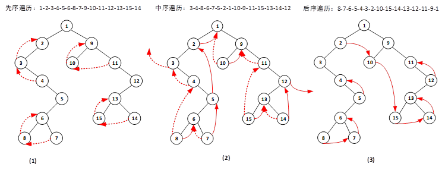

### 6.21 画出和下列二叉树相应的森林：

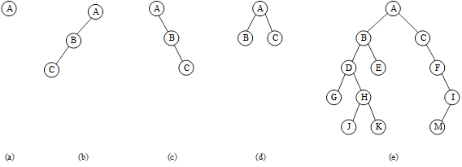

> 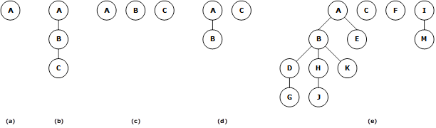

### 6.22 对于 6.19 题中给出的各树分别求出以下遍历序列：

##### (1)先根序列；

##### (2)后根序列。

> (1) (a)A (b)A B C (c)A B C (d)A B C E I J F G K H D  
> (2) (a)A (b)C B A (c)B C A (d)B I J E F K G H C D A

### 6.23 画出和下列已知序列对应的树 T：

##### 树的先根次序访问序列为 GFKDAIEBCHJ;

##### 树的后根次序访问序列为 DIAEKFCJHBG。

> ★★ 树的先根次序相当于二叉树的先序次序；树的后跟次序相当于二叉树的中序次序。  
> 先画出相应的二叉树如(1)，再根据二叉树画出树如(2)：  
> 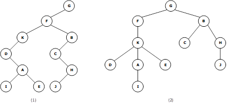

### 6.24 画出和下列已知序列对应的森林 F：

##### 森林的先序次序访问序列为：ABCDEFGHIJKL；

##### 森林的中序次序访问序列为：CBEFDGAJIKLH。

> ★★ 森林的先序次序相当于二叉树的先序次序；森林的中序次序相当于二叉树的中序次序。  
> 先画出相应的二叉树如(1)，再根据二叉树画出森林如(2)：  
> 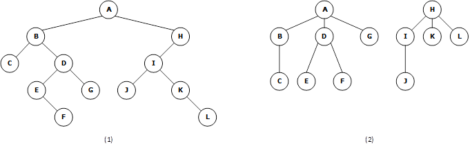

### 6.25 证明：在结点数多于 1 的哈夫曼树中不存在度为 1 的结点。

> 证明：（数学归纳法）
>
> (1)当 n=2 时，要使其成为最优二叉树，必须使两个结点都成为叶子结点。
>
> (2)假设当 n=k(k>2)时，结论也成立，则当 n=k+1 时，要使其成为最优二叉树，必须用前 k 个结点构造出的哈夫曼树与第 k+1 个结点组成一个新的最优二叉树，所以 n=k+1 也成立。
>
> (3)综上，结论成立。

### 6.26 假设用于通信的电文仅由 8 个字母组成，字母在电文中出现的频率分别为 0.07, 0.19, 0.02, 0.06, 0.32, 0.03, 0.21, 0.10。试为这 8 个字母设计哈夫曼编码。使用 0~7 的二进制表示形式是另一种编码方案。对于上述实例，比较两种方案的优缺点。

> (1) 哈夫曼树如下：  
> 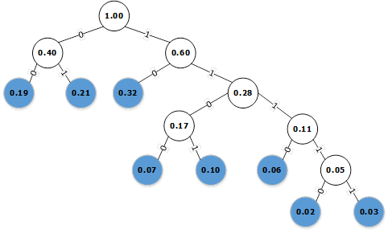
> 由此可得哈夫曼编码为：  
> 0.02 →→ 1 1 1 1 0  
> 0.03 →→ 1 1 1 1 1  
> 0.06 →→ 1 1 1 0  
> 0.07 →→ 1 1 0 0  
> 0.10 →→ 1 1 0 1  
> 0.19 →→ 0 0  
> 0.21 →→ 0 1  
> 0.32 →→ 1 0
>
> (2)若采用 0-7 的二进制编码，则（方式不一）：  
> 0.02 →→ 0 →→ 0 0 0  
> 0.03 →→ 1 →→ 0 0 1  
> 0.06 →→ 2 →→ 0 1 0  
> 0.07 →→ 3 →→ 0 1 1  
> 0.10 →→ 4 →→ 1 0 0  
> 0.19 →→ 5 →→ 1 0 1  
> 0.21 →→ 6 →→ 1 1 0  
> 0.32 →→ 7 →→ 1 1 1  
> 哈夫曼编码计算时候比直接用二进制编码要繁琐些，但是在发电文时，采用哈夫曼编码制作的电文长度最短。

### 6.27 假设一棵二叉树的先序序列为 EBADCFHGIKJ 和中序序列为 ABCDEFGHIJK。请画出该树。

### 6.28 假设一棵二叉树的中序序列为 DCBGEAHFIJK 和后序序列为 DCEGBFHKJIA。请画出该树。

### 6.29 假设一棵二叉树的层序序列为 ABCDEFGHIJ 和中序序列为 DBGEHJACIF。请画出该树。

> 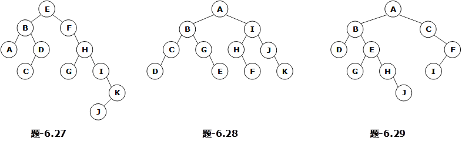

### 6.30 证明：树中结点 u 是结点 v 的祖先，当且仅当在先序序列中 u 在 v 之前，且在后序序列中 u 在 v 之后。

> 证明：命题等价于遍历时 u 在 v 之前的充要条件是遍历序列为先序序列，u 在 v 之后的充要条件是遍历序列为后序遍历。
>
> 由于 u 是 v 的祖先，故若以 u 为根结点，v 必在 u 的左子树或右子树上。考虑三种遍历次序，先序遍历是根结点-左子树-右子树，中序遍历是左子树-根结点-右子树，后序遍历是左子树-右子树-根结点。
>
> (1) 充分性：  
> 若要保证 u 在 v 之前，必须保证根结点的访问先于子树，即采用先序遍历。相反，要保证 u 在 v 之后，必须保证根结点的访问迟于子树，即采用后序遍历。
>
> (2)必要性：  
> 若采用先序序列，必然先访问根结点，后访问其子树，故 u 的访问必先于 v。若采用后序序列，则根结点在最后被访问，因而 u 的访问必在 v 之后。
>
> 综上分析，原命题成立。

### 6.31 证明：由一棵二叉树的先序序列和中序序列可唯一确定这课二叉树。

> 证明：命题等价于证明由一棵二叉树的先序序列和中序序列可唯一确定任一结点的位序，进一步等价于证明由一棵二叉树的先序序列和中序序列可唯一确定任一结点的父结点值及其属于此父结点的左孩子还是右孩子。
>
> (1)根据二叉树性质，每一个结点最多只有一个父结点，所以无论其遍历序列如何，其父结点的值要么不存在（根结点），要么存在且唯一。
>
> (2)二叉树先序遍历序列为根结点-左子树-右子树，中序遍历序列为左子树-根结点-右子树。由此可得，对于任一结点，在先序序列中寻找其前驱，若前驱不存在，说明此结点是树的根结点，若前驱存在，再判断此结点与其前驱在中序序列中的相对次序，若其前驱位于其右边， 则可断定该结点为其父结点的左子树，否则为右子树。
>
> 这样一来，根据先序序列和中序序列，就可以唯一确定每一个结点的父结点值及其相对位置（左子树或右子树），进而确定每个结点的位置，由此就可确定唯一的二叉树。

### 6.32 证明：如果一棵二叉树的先序序列是 u1，u2，…，un，中序序列是 up1，up2，…，upn，则序列 1,2，…，n 可以通过一个栈得到序列 p1，p2，…，pn；反之，若以上述中的结论作为前提，则存在一棵二叉树，若其前序序列是 u1，u2，…，un，则其中序序列为 up1，up2，…，upn。

> 暂未想到合适的证明过程。如有好的方案，欢迎提交 Issues。

### 二、算法设计题

### 6.33 假定用两个一维数组 L[n+1]和 R[n+1]作为有 n 个结点的二叉树的存储结构，L[i]和 r[i]分别指示结点 i（i=1,2,…,n）的左孩子和右孩子，0 表示空。试写一个算法判别结点 u 是否为结点 v 的子孙。

### 6.34 同 6.33 题的条件。先由 L 和 R 建立一维数组 T[n+1]，使 T 中第 i（i=1,2,…,n）个分量指示结点 i 的双亲，然后写判别结点 u 是否为结点 v 的子孙的算法。

---

### 6.35 假设二叉树中左分支的标号为“0”，右分支的标号为“1”，并对二叉树增设一个头结点，令根结点为其右孩子，则从头结点到树中任一结点所经分支的序列为一个二进制序列，可认作是某个十进制数的二进制表示。例如，右图所示二叉树中，和结点 A 对应的二进制序列为“110”，即十进制整数 6 的二进制表示。已知一棵非空二叉树以顺序存储结构表示，试写一尽可能简单的算法，求出与在树的顺序存储结构中下标值为 i 的结点对应的十进制整数。

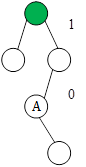

---

> > ### 在以下 6.36 至 6.38 和 6.41 至 6.53 题中，均以二叉链表作为二叉树的存储结构。

### 6.36 若已知两棵二叉树 B1 和 B2 皆为空，或者皆不空且 B1 的左、右子树和 B2 的左、右子树分别相似，则称二叉树 B1 和 B2 相似。试编写算法，判别给定两棵二叉树是否相似。

---

### 6.37 试利用栈的基本操作写出先序遍历的非递归形式的算法。

### 6.38 同 6.37 题条件，写出后序遍历的非递归算法（提示：为分辨后序遍历时两次进栈的不同返回点，需在指针进栈时同时将一个标志进栈）。

---

### 6.39 假设在二叉链表的结点中增设两个域：双亲域（parent）以指示其双亲结点；标志域（mark 取值 0、1、2）以区分在遍历过程中到达该结点时应继续向左或向右或访问该结点。试以此存储结构编写不用栈进行后序遍历的递推形式的算法。

---

### 6.40 若在二叉链表的结点中只增设一个双亲域以指示其双亲结点，则在遍历过程中能否不设栈？试以此存储结构编写不设栈进行中序遍历的递推形式的算法。

---

### 6.41 编写递归算法，在二叉树中求位于先序序列中第 k 个位置的结点的值。

### 6.42 编写递归算法，计算二叉树中叶子结点的数目。

### 6.43 编写递归算法，将二叉树中所有结点的左、右子树相互交换。

### 6.44 编写递归算法：求二叉树中以元素值为 x 的结点为根的子树的深度。

### 6.45 编写递归算法：对于二叉树中每一个元素值为 x 的结点，删去以它为根的子树，并释放相应的空间。

### 6.46 编写复制一棵二叉树的非递归算法。

### 6.47 编写按层次顺序（同一层自左至右）遍历二叉树的算法。

### 6.48 已知在二叉树中，\*root 为根结点，\*p 和\*q 为二叉树中两个结点，试编写求距离它们最近的共同祖先的算法。

### 6.49 编写算法判别给定二叉树是否为完全二叉树。

---

### 6.50 假设以三元组（F，C，L/R）的形式输入一棵二叉树的诸边（其中 F 表示双亲结点的标识，C 表示孩子结点标识，L/R 表示 C 为 F 的左孩子或右孩子），且在输入的三元组序列中，C 是按层次顺序出现的。设结点的标识是字符类型。F=‘\^’时 C 为根结点标识，若 C 也为‘\^’，则表示输入结束。例如，6.15 题所示的二叉树的三元组序列输入格式为：

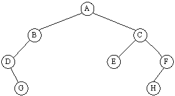

```
^AL
ABL
ACR
BDL
CEL
CFR
DGR
FHL
^^L
```

#### 试编写算法，由输入的三元组序列建立二叉树的二叉链表。

---

### 6.51 编写一个算法，输出以二叉树表示的算术表达式，若该表达式中含有括号，则在输出时应添上。

---

### 6.52 一棵二叉树的繁茂度定义为各层结点数的最大值与树的高度的乘积。试写一算法，求二叉树的繁茂度。

---

### 6.53 试编写算法，求给定二叉树上从根结点到叶子结点的一条其路径长度等于树的深度减一的路径（即列出从根结点到该叶子结点的结点序列），若这样的路径存在多条，则输出路径终点（叶子结点）在“最左”的一条。

---

### 6.54 假设以顺序表 sa 表示一棵完全二叉树，sa.elem[1..sa.last]中存放树中各结点的数据元素。试编写算法由此顺序存储结构建立该二叉树的二叉链表。

---

### 6.55 为二叉链表的结点增加 DescNum 域。试编写一算法，求二叉树的每个结点的子孙数目并存入其 DescNum 域。请给出算法的时间复杂度。

---

### 6.56 试写一个算法，在先序后继线索二叉树中，查找给定结点\*p 在先序序列中的后继（假设二叉树的根结点未知）。并讨论实现此算法对存储结构有何要求？

---

### 6.57 试写一个算法，在后序后继线索二叉树中，查找给定结点\*p 在后序序列中的后继（二叉树的根结点指针并未给出）。并讨论实现此算法对存储结构有何要求？

---

### 6.58 试写一个算法，在中序全线索二叉树的结点\*p 之下，插入一棵以结点\*x 为根、只有左子树的中序全线索二叉树，使\*x 为根的二叉树成为\*p 的左子树。若\*p 原来有左子树，则令它为\*x 的右子树。完成插入之后的二叉树应保持全线索化特性。

---

### 6.59 编写算法完成下列操作：无重复地输出以孩子-兄弟链表存储的树 T 中所有的边。输出的形式为(k<sub>1</sub>, k<sub>2</sub>), …, (k<sub>i</sub>, k<sub>j</sub>), …,其中，ki 和 kj 为树结点中的结点标识。

### 6.60 试编写算法，对一棵以孩子-兄弟链表表示的树统计叶子的个数。

### 6.61 试编写算法，求一棵以孩子-兄弟链表表示的树的度。

### 6.62 对以孩子-兄弟链表表示的树编写计算树的深度的算法。

---

### 6.63 对以孩子链表表示的树编写计算树的深度的算法。

---

### 6.64 对以双亲表表示的树编写计算树的深度的算法。

---

### 6.65 已知一棵二叉树的前序序列和中序序列分别存于两个一维数组中，试编写算法建立该二叉树的二叉链表。

---

### 6.66 假设有 n 个结点的树 T 采用了双亲表示法，写出由此建立树的孩子-兄弟链表的算法。

---

### 6.67 假设以二元组（F，C）的形式输入一棵树的诸边（其中 F 表示双亲结点的标识，C 表示孩子结点标识），且在输入的二元组序列 C 中，C 是按层次顺序出现的。F='\^'时 C 为根结点标识，若 C 也为'\^'，则表示输入结束。例如，如下所示树的输入序列为：

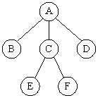

```
^A
AB
AC
AD
CE
CF
^^
```

#### 试编写算法，由输入的二元组序列建立该树的孩子-兄弟链表。

---

### 6.68 已知一棵树的由根至叶子结点按层次输入的结点序列及每个结点的度（每层中自左至右输入），试写出构造此树的孩子-兄弟链表的算法。

---

### 6.69 假设以二叉链表存储的二叉树中，每个结点所含数据元素均为单字母，试编写算法，按树形状打印二叉树的算法。例如：左下二叉树印为右下形状。

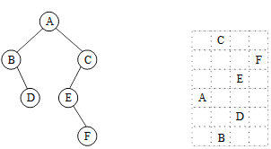

> 根据题意，图中形状从上到下为树的逆中序遍历（右-根-左），且带层序信息的访问次序。逆中序序列反映在行，层序信息反应在列。

---

### 6.70 如果用大写字母标识二叉树结点，则一棵二叉树可以用符合下面语法图的字符序列表示。试写一个递归算法，由这种形式的字符序列，建立相应的二叉树的二叉链表存储结构。

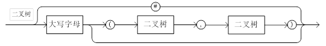

#### 例如：6.39 题所示的二叉树输入形式为 A(B(#,D),C(E(#,F),#))。

---

### 6.71 假设树上每个结点所含的数据元素为一个字母，并且以孩子-兄弟链表为树的存储结构，试写一个按凹入表方式打印一棵树的算法。例如：左下所示树印为右下形状。

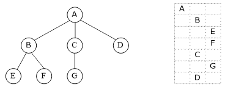

---

### 6.72 以孩子链表为树的存储结构，重做 6.71 题。

---

### 6.73 若用大写字母标识树的结点，则可用带标号的广义表形式表示一棵树，其语法图如下所示：

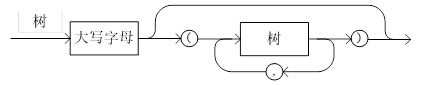

#### 例如，6.71 题中的树可用下列形式的广义表表示：A(B(E,F),C(G),D)

### 试写一递归算法，由这种广义表表示的字符序列构造树的孩子-兄弟链表（提示：按照森林和树相互递归的定义写两个互相递归调用的算法，语法图中一对圆括号内的部分可看成为森林的语法图）。

### 6.74 试写一递归算法，以 6.73 题给定的树的广义表表示法的字符序列形式输出以孩子-兄弟链表表示的树。

---

### 6.75 试写以递归算法，由 6.73 题定义的广义表表示法的字符序列，构造树的孩子链表。

### 6.76 试写以递归算法，以 6.73 题给定的树的广义表表示法的字符序列形式输出以孩子链表表示的树。

---
